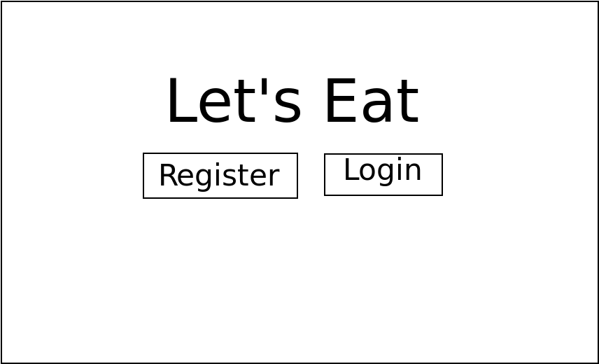
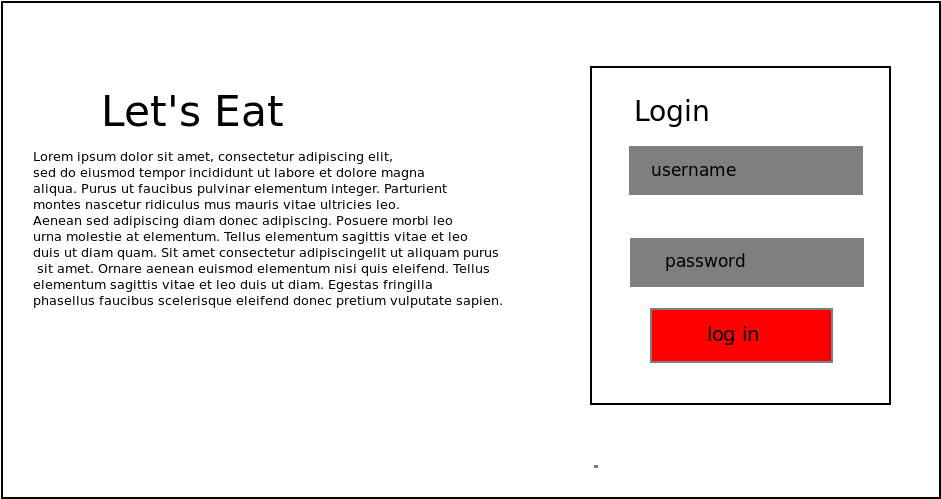
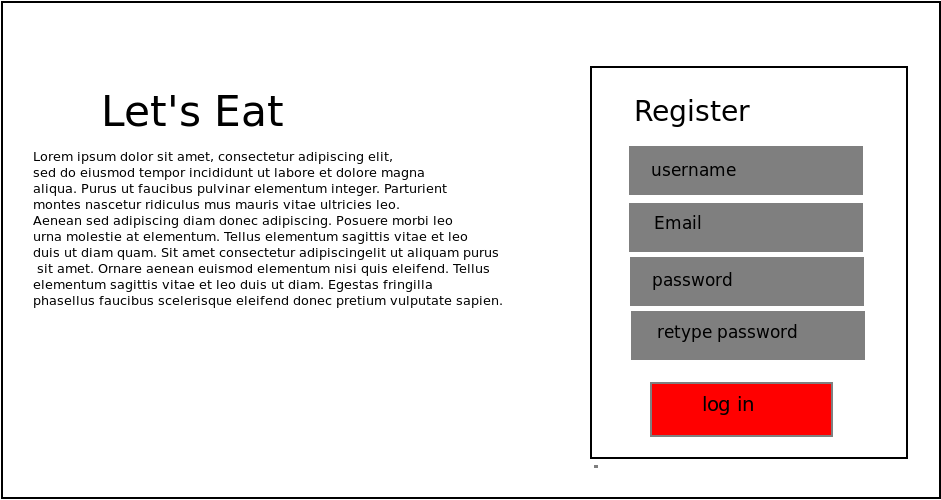
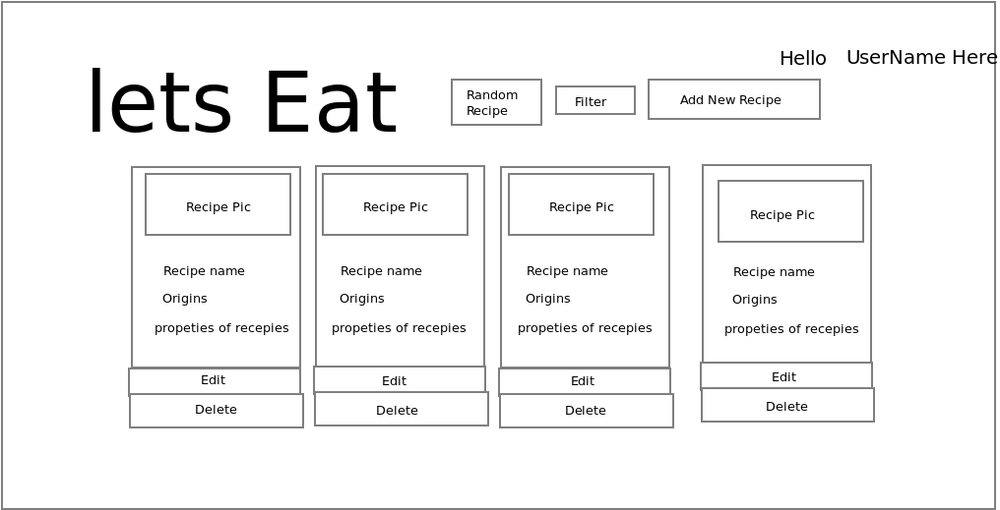
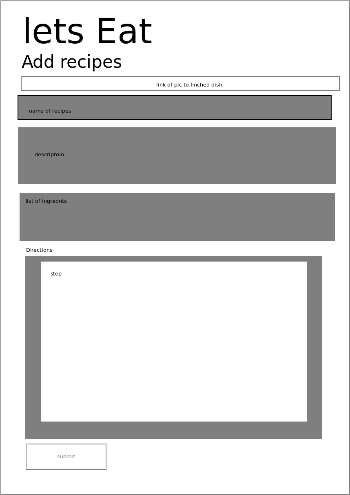
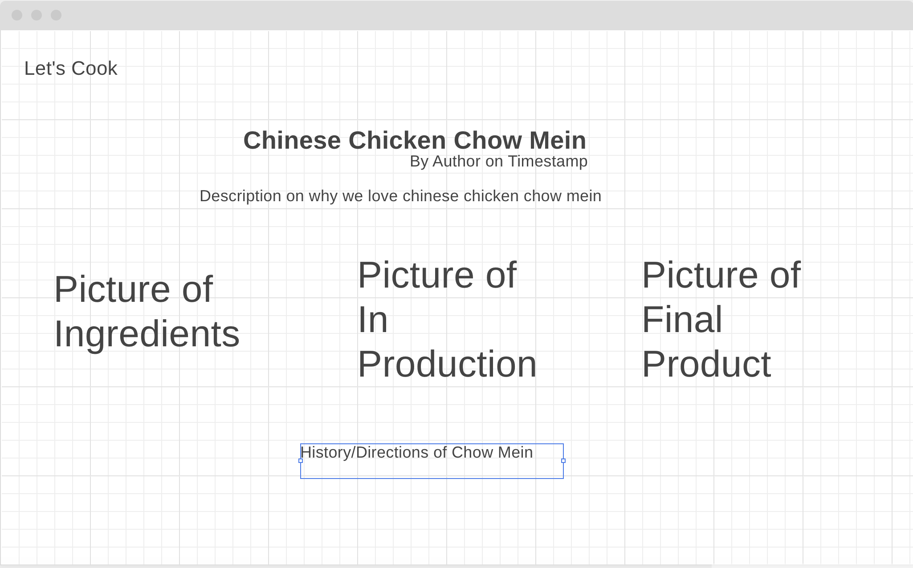
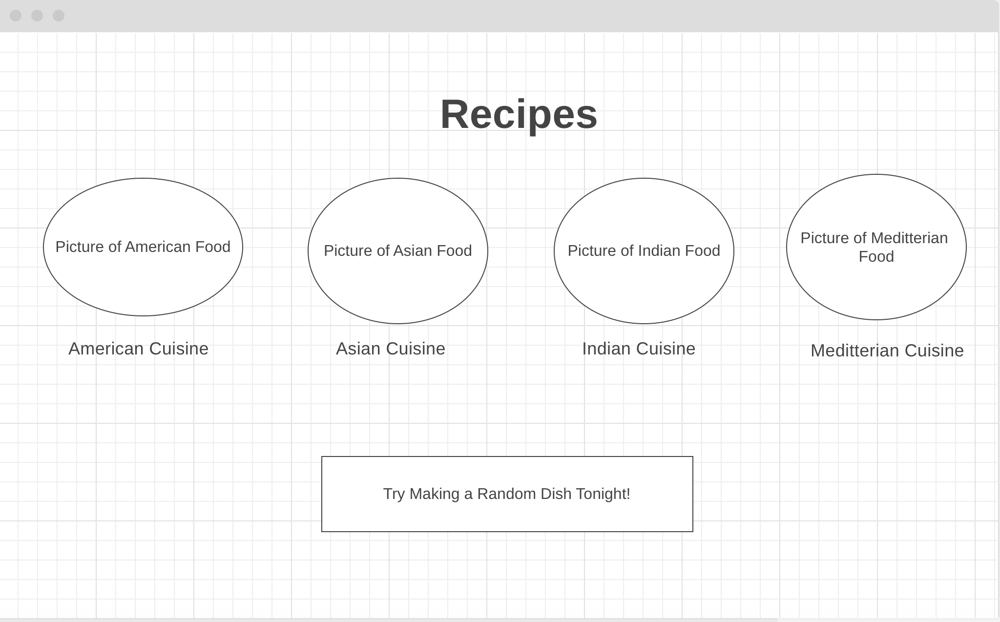

## Project 1 
By Alvin Wong and Luncky Li

___

## The Project: Let's Eat

The project is a website that will get random recipes from other users on the website based on the users personal prefrence.

___
## Scope 

The finish product is build a app where user can make and get random recipes base on their food prefrence. User will be able to see all the recipes that are on the database.User will be able to rate the recipes. 

#### Technologies in Play 
    -CSS 
        -bootstrap
    -javascript 
    -express.js 
    -node.js
    -ejs
    -mongodb
    -moongoose 

## User Stories 
I. The user when they go to the root of the website they will see the logo Let's Eat and 2 button one saying Let's Cook other will be Sign Me Up!

II. When the user  clicked on Let's Cook, the user will be taken to the login page where the user can log in into their account.

III. When the user  click on Sign Me up they will be taken to the register page where they can register

IV. When they log into their account the user see 4 random recipes based on their food prefrence  as well as a add new recipe, show their recipes. As welll as two button on the button to edit and delete their accout 

V. The user can also see all the recipes on the site\

VI. When a user clicks on the recipe they can look at it in more details

## Wire Frames

